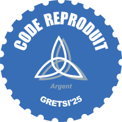

# GRETSI'25 - Label Reproductible - Rapport de l'issue #08

Code testé par Luc VEDRENNE.

## Infos du dépôt

* ID de l'article : 1440
* Titre de l'article : Frugalité en télédétection : évaluer la performance et la consommation énergétique en détection de changements d’images PolSAR
* URL du dépôt git du code : [https://github.com/MattVerlynde/frugal-gretsi-2025.git](https://gitlab.com/thibaut_29450/recherche_reproductible_gretsi25)
* Langage(s) : Python

## Configuration utilisée par le reviewer

* OS (nom et version) : Ubuntu 22.04.5 LTS x86_64
* Processeur
  * Nom : Intel Xeon W-2225
  * Nombre de cœurs : 8
* Carte graphique
  * Nom : NVIDIA GeForce RTX 3090 Ti
  * Mémoire dédiée : 24564MiB
* Taille de la RAM : 31784MiB

## A - État initial avant review

1. **Toutes les infos** de l'issue étaient exactes :
   * [x] Oui
   * [ ] Non
2. Le dépôt était **public** dès le départ :
   * [x] Oui
   * [ ] Non
3. Il y avait un **README** avec des instructions pour compiler/exécuter le code :
   * [x] Oui
   * [ ] Non
4. Les **données** nécessaires pour reproduire les résultats étaient disponibles :
   * [x] Oui, toutes
   * [ ] Oui, en grande partie
   * [ ] Non, il manquait des données essentielles
5. Les **éléments à reproduire** étaient accessibles :
   * [x] Oui, tous
   * [ ] Oui, en grande partie
   * [ ] Non, il manquait des éléments essentiels

Commentaires éventuels : 

D'après les commentaires laissés, je compte reproduire la seconde implémentation, qui utilise la consommation éstimée par le package CodeCarbon.

## B - Procédure suivie pendant la review

> _Détaillez ici toutes les étapes suivies pour reproduire les résultats : les commandes utilisées pour installer les dépendances, compiler et exécuter, etc._

-> Ce n'est pas précisé mais il faut clone avec les submodules:
- `git clone --recurse-submodules -j8 git@github.com:MattVerlynde/frugal-gretsi-2025.git`
- cd frugal-gretsi-2025/

- j'ai modifié le fichier environment.yml avec:
   - htcondor==23.5.2 -> htcondor==24.7.3
   - qanat==0.1.0 -> git+https://github.com/ammarmian/qanat

- mamba env create -f environment.yml

- Il y a un path hardcodé dans le fichier get_stat.py:L23.
   -> remplacé par `sys.path.append(os.path.dirname(os.path.dirname(os.path.abspath(__file__))))`

## C - Bilan

### _1 - État du dépôt Git_

* Le dépôt est **public** :
  * [x] Oui
  * [ ] Non
* Il y a un **README** avec des instructions pour compiler/exécuter le code :
  * [ ] Oui, et elles sont exhaustives
  * [x] Oui, avec quelques détails mineurs qui manquent
  * [] Oui, avec des informations importantes qui manquent
  * [ ] Non
* Les **données** nécessaires pour reproduire les résultats sont disponibles publiquement :
  * [x] Oui, toutes
  * [ ] Oui, en grande partie
  * [ ] Pas encore, elles le seront si l'article est accepté et le label décerné
  * [ ] Non, il manque des données essentielles qui ne pourront pas être rendues publiques
* Les **éléments à reproduire** sont accessibles :
  * [x] Oui, tous
  * [ ] Oui, en grande partie
  * [ ] Non, il manque des éléments essentiels

Commentaires éventuels : 

### _2 - Reproductibilité_

1. **Temps de compilation** constaté : non concerné
2. **Temps d'exécution** constaté : 71.65 heures.
3. Le code **compile** :
   * [ ] sans erreur
   * [ ] avec des erreurs
   * [x] non concerné
4. Le code s'**exécute** :
   * [x] sans erreur
   * [ ] avec des erreurs
5. Si le code s'exécute **sans erreur**, cela s'est fait :
   * [ ] sans modifications du code initialement soumis
   * [x] avec quelques changements mineurs du code initialement soumis
   * [ ] avec des changements importants du code initialement soumis
6. Les **résultats attendus** sont obtenus :
   * [x] toujours
   * [ ] parfois
   * [ ] jamais
7. Les **résultats obtenus** correspondent à ceux indiqués par les auteurs dans leur papier :
   * [ ] exactement
   * [x] avec quelques différences négligeables
   * [ ] avec quelques différences notables
   * [ ] avec beaucoup de différences

Commentaires éventuels : 

## Résultat

En tant que reviewer, **j'estime** qu'à la fin de ma review, **le dépôt de l'auteur permet de reproduire les résultats annoncés** :

* [x] Oui, tous
* [] Oui, avec quelques réserves
* [ ] Non

Commentaires éventuels : 

Ce serait bien de mettre à jour le code avec mes modifications.